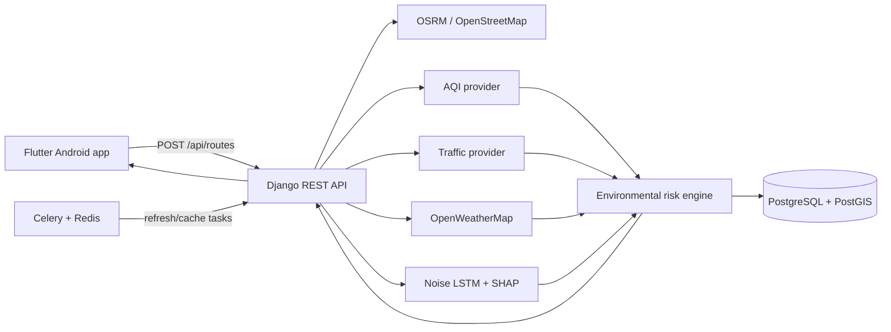
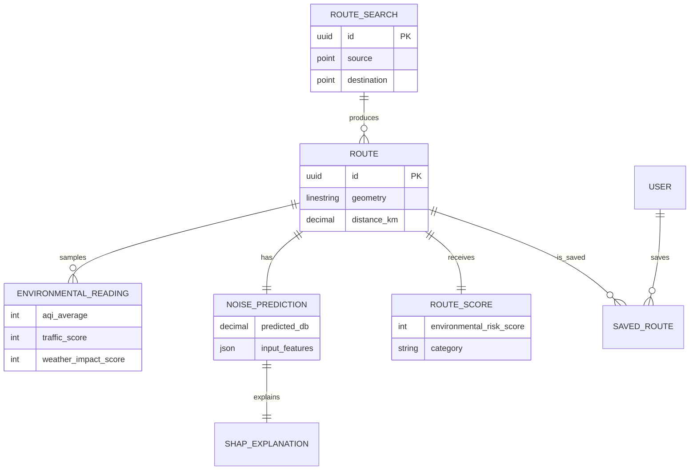

# EcoRoute architecture

The API owns provider-specific adaptation, validates route input, records the sampled inputs and outputs, and returns ranked routes in a mobile-friendly response. Provider calls must be cached by coordinate/time bucket in production to respect quotas.

## Environmental score

All components are normalized to 0–100 before the final score:

`risk = 0.35 × AQI + 0.25 × noise + 0.25 × traffic + 0.15 × weather`

Scores of 0–30 are Safe, 31–60 Moderate, and 61–100 High Risk. Lower is better.

## Data model

## ML lifecycle

Use `backend/ml/train_noise.py` with timestamp-ordered, road-segment-labelled observations. It uses a sequence LSTM, saves a Keras artifact plus scaler, and exposes a SHAP GradientExplainer adapter. Register a model version, its evaluation metrics, and the data window before promoting it. The API deliberately serves a labelled deterministic baseline until a trained artifact is present; it does not claim demo estimates are LSTM inference.
